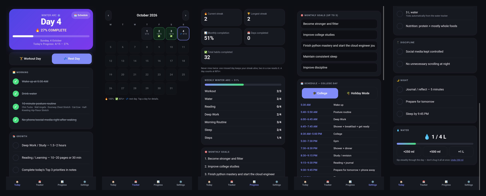
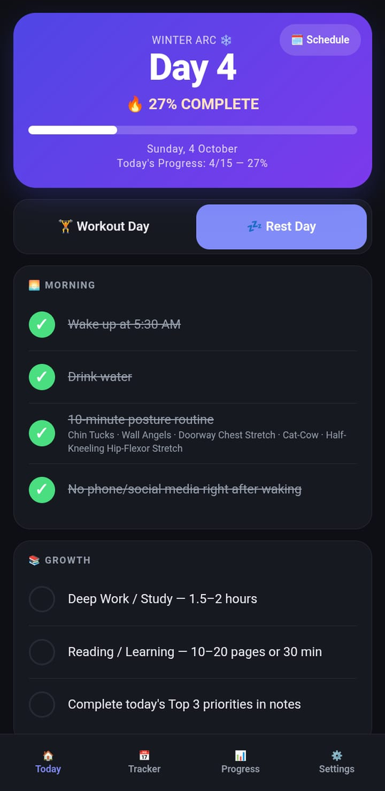
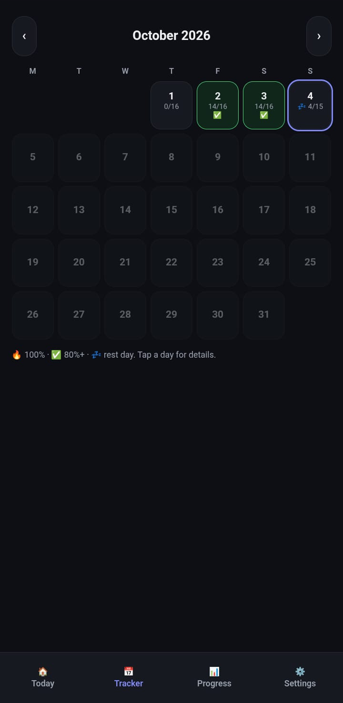
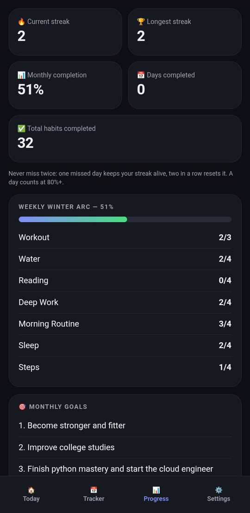
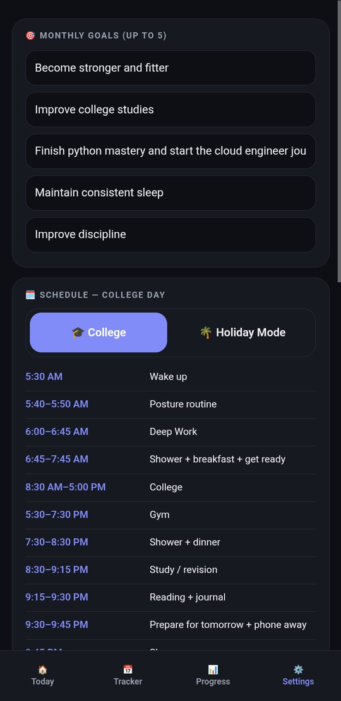

# ❄️ Winter Arc — Habit Tracker

A simple, offline-first daily habit tracker for Android. Open it, tick today's habits, track your streak.

## Features
- Daily checklist with live completion %
- Workout / Rest day toggle (rest days don't count as a miss)
- Monthly calendar with per-day details
- Streaks using the "never miss twice" rule
- Weekly summary and monthly goals
- Water tracker (4 L target)
- College and Holiday schedules
- No login, no tracking, data stays on your device

## Tech
- HTML, CSS and vanilla JavaScript (single file)
- Capacitor to wrap it as an Android app
- GitHub Actions builds the APK automatically (CI/CD)

## Get the APK
1. Open the **Actions** tab
2. Open the latest **Build APK** run
3. Download **winter-arc-apk** from Artifacts
4. Unzip and install `app-debug.apk`

## Develop
Edit `www/index.html` and push to `main`. A new APK is built automatically.

## Screenshots

  
  
  
  

